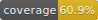

# @thx/controls



A collection of form components designed with Semantic UI. They all adhere to the policy of having a value prop and an onChange() prop.

## Install
```
yarn add @thx/controls
```

## Documentation

You can find API documentation [here](/docs).
