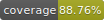

# @thx/tschemas



Useful yup schema shortcuts

## Install
```
yarn add @thx/tschemas
```

## Usage

```
import {shape} from 'yup';
import {localDate} from '@thx/tschemas';

const schema = shape({
  myDate: localDate().required(),
});
```

## Documentation

You can find API documentation [here](/docs).
